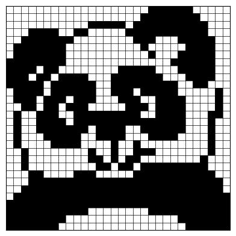

# A problem of discrete tomography 

## Project description
We consider a grid with N rows numbered from 0 to $N-1$ and $M$ columns numbered from $0$ to $M-1$. Each of the $N × M$ cells must be colored in black or white. Each row $l_i$, where $i = 0, . . . , N-1$, is associated with a sequence of integers representing the lengths of black blocks in the row. Similarly, for each column $c_j$, where $j = 0, . . . , M-1$, there is an associated sequence of integers representing the lengths of black blocks!

Consider the following example:


The 3 in the row $l_0$ means that it contains a block of three consecutive black cells. The sequence `1 2` in column $c_2$ means that it contains two blocks: the first of one black cell, and the second of two black cells (blocks are separated by at least one white cell).
A solution to the game is:


The goal of the project is to construct, if possible, a solution (a black-white coloring of the cells) that satisfies the constraints.

## How to use
#### File structure
- `main.py`: Main script for running the tomography solver.
- `methode_incomplete.py`: Module containing the incomplete method functions.
- `methode_complete.py`: Module containing the complete method functions.
- `config.py`: Configuration file for constants and settings.
- `/grids`: Folder containing the grid descriptions.
- `/out`: Folder containing the solutions.

#### Running the program
This project contains two types of algorithms:

- An **incomplete** algorithm that does not determine the color of all cells in every case.
- A **complete** algorithm that accurately determines the color of each cell in a grid.

To run the programm, use the following command line:
```
python main.py
```

Where execution modes are:
- `I` : to run the incomplete algorithm with all grids located in /grids
- `C`: to run the complete algorithm with all grids located in /grids
- `A`: to run the complete or complete algorithm on a specific grid, by specifying the algorithm (0 for incomplete and 1 for complete) and the grid number

**Note:** Some grids might take longer than others.
## Solution examples
<u>**Grid 10:**</u>


<u>**Grid 15:**</u>

